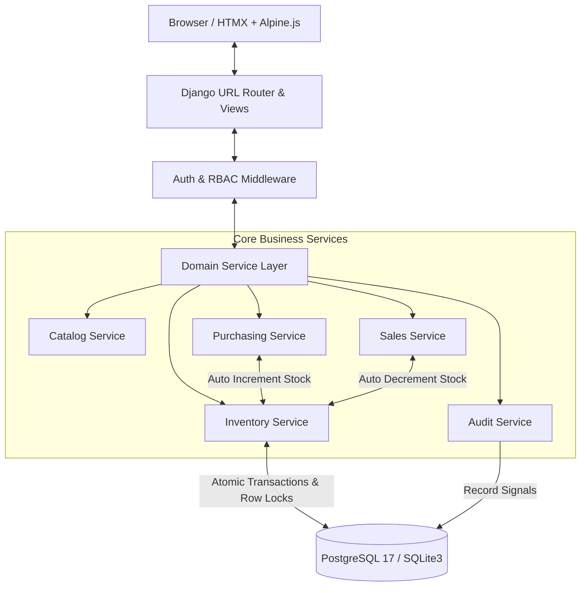
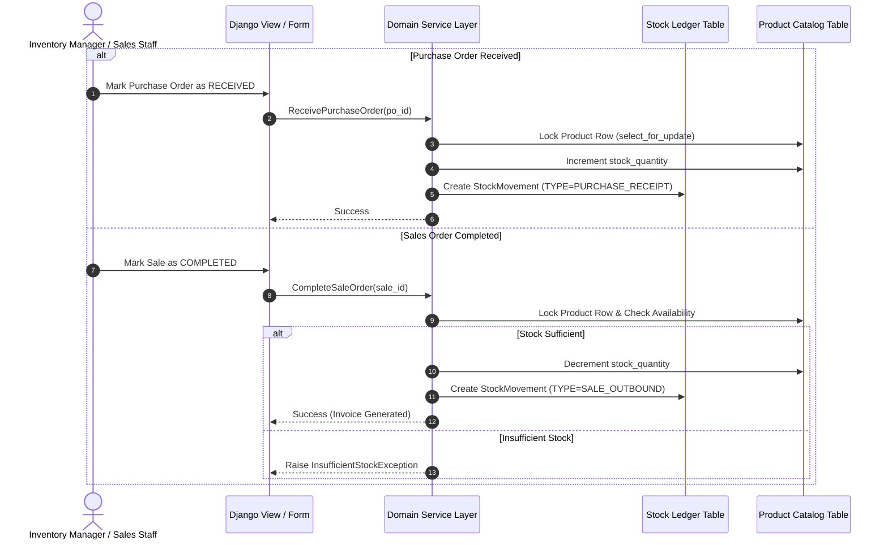

# 📦 Inventory Management System (IMS)

<div align="center">


</div>

<p align="center">
  <b>An Enterprise-Grade, Server-Rendered Inventory Management System built with Django 5.2, PostgreSQL, and Tailwind CSS.</b><br>
  Streamline products, suppliers, purchase orders, sales invoices, stock movements, and real-time analytics from a unified, role-aware dashboard.
</p>

---

## 📑 Table of Contents

- [✨ Executive Summary & Key Features](#-executive-summary--key-features)
- [🏗️ System Architecture & Visual Workflows](#️-system-architecture--visual-workflows)
  - [Architecture Flow](#architecture-flow)
  - [Stock Ledger Lifecycle](#stock-ledger-lifecycle)
- [🎯 Software Use Cases & Business Modules](#-software-use-cases--business-modules)
  - [1. Executive Dashboard & Real-Time Analytics](#1-executive-dashboard--real-time-analytics)
  - [2. Catalog & Product Management](#2-catalog--product-management)
  - [3. Supplier & Purchasing Workflow](#3-supplier--purchasing-workflow)
  - [4. Sales & Invoicing Workflow](#4-sales--invoicing-workflow)
  - [5. Stock Movement Ledger & Adjustments](#5-stock-movement-ledger--adjustments)
  - [6. Role-Based Access Control (RBAC)](#6-role-based-access-control-rbac)
  - [7. Immutable Audit Trail](#7-immutable-audit-trail)
- [📁 Project Directory Structure](#-project-directory-structure)
- [🛠️ Technology Stack & Tooling](#️-technology-stack--tooling)
- [⚙️ Getting Started & Installation Guide](#️-getting-started--installation-guide)
  - [Prerequisites](#prerequisites)
  - [Step-by-Step Setup](#step-by-step-setup)
  - [Preset Demo User Credentials](#preset-demo-user-credentials)
- [💡 Engineering Principles & How It Works](#-engineering-principles--how-it-works)
  - [Service Layer Pattern](#service-layer-pattern)
  - [Concurrency & Data Integrity](#concurrency--data-integrity)
- [🧪 Testing & Code Quality](#-testing--code-quality)
- [📚 Documentation Index](#-documentation-index)

---

## ✨ Executive Summary & Key Features

The **Inventory Management System (IMS)** eliminates manual spreadsheets and stock discrepancies by providing a centralized, audit-compliant platform. Built with Django's modular app architecture, it guarantees **atomic data consistency** and **zero negative inventory** under concurrent usage.

### 🌟 Core Capabilities
- 📊 **Real-Time Analytics Dashboard**: Monitor total stock valuation, low stock alerts, pending POs, and sales revenue trends at a glance.
- 📦 **Smart Catalog Management**: Categorize items, track SKUs, define reorder points, and manage unit costs versus selling prices.
- 🛒 **Purchasing & Automated Stock-In**: Issue Purchase Orders (POs) with multi-stage approval (`DRAFT` → `ORDERED` → `RECEIVED`). Receiving automatically updates stock levels.
- 💰 **Sales & Stock-Out Validation**: Process Sales Orders (`PENDING` → `COMPLETED`) with automated stock availability checks. Generates printable HTML/PDF invoices.
- 🔄 **Append-Only Stock Ledger**: Tracks every stock movement (`RECEIPT`, `SALE`, `ADJUSTMENT`, `DAMAGE`, `THEFT`) with full audit history and user attribution.
- 🔐 **Strict Role-Based Access Control (RBAC)**: Fine-grained permissions for Administrators, Inventory Managers, Sales Staff, and Viewers.
- 📜 **Comprehensive Audit Logging**: Tracks model modifications, user IP addresses, timestamps, and changed field diffs.

---

## 🏗️ System Architecture & Visual Workflows

### Architecture Flow

The system employs a clean, server-rendered **Django MVT + Domain Service Layer** architecture with reactive micro-interactions via **HTMX** and **Alpine.js**.



### Stock Ledger Lifecycle

Every inventory change follows a strict double-entry ledger process, ensuring stock levels are never directly edited without a logged movement reason.



---

## 🎯 Software Use Cases & Business Modules

### 1. Executive Dashboard & Real-Time Analytics
- **KPI Metrics**: Total Inventory Value, Active SKUs, Low-Stock Item Count, Monthly Purchasing Spend vs. Sales Revenue.
- **Stock Alert Feed**: Highlight items reaching or falling below their configured `min_stock_level`.
- **Recent Activity Timeline**: Real-time stream of recent purchases, completed sales, and manual adjustments.

### 2. Catalog & Product Management
- **Category Hierarchy**: Tree-like category structure for flexible product organization.
- **Product SKUs**: Unique SKU generation, barcode reference, unit pricing, unit cost, and reorder thresholds.
- **Supplier Directory**: Centralized vendor database storing contact information, lead times, and active PO history.

### 3. Supplier & Purchasing Workflow
- **PO Creation**: Draft purchase orders containing multiple line items, target delivery dates, and cost breakdowns.
- **Lifecycle Management**:
  - `DRAFT`: Order being created.
  - `ORDERED`: Transmitted to supplier.
  - `RECEIVED`: Stock verified and ingested into inventory ledger automatically.
  - `CANCELLED`: Order aborted before receipt.

### 4. Sales & Invoicing Workflow
- **Sales Order Processing**: Fast checkout interface with real-time price lookup and stock availability validation.
- **Lifecycle Management**:
  - `PENDING`: Draft or active customer order.
  - `COMPLETED`: Payment confirmed, stock decremented, invoice issued.
  - `CANCELLED`: Order voided.
- **Printable Invoices**: Professional template ready for download or client printing.

### 5. Stock Movement Ledger & Adjustments
- **Movement Types**: `PURCHASE_RECEIPT`, `SALE_OUTBOUND`, `MANUAL_ADJUSTMENT`, `DAMAGE_SPOILAGE`, `THEFT_LOSS`, `RESTOCK`.
- **Manual Stock Adjustments**: Audit-logged override flow requiring explicit justification notes for stock reconciliations.

### 6. Role-Based Access Control (RBAC)

| Feature / Action           | Administrator | Inventory Manager | Sales Staff | Viewer |
| -------------------------- | :-----------: | :---------------: | :---------: | :----: |
| View Dashboard & Products  |      ✅       |        ✅         |     ✅      |   ✅   |
| Create / Edit Products     |      ✅       |        ✅         |     ❌      |   ❌   |
| Manage Suppliers           |      ✅       |        ✅         |     ❌      |   ❌   |
| Create & Receive POs       |      ✅       |        ✅         |     ❌      |   ❌   |
| Process Sales & Invoices   |      ✅       |        ❌         |     ✅      |   ❌   |
| Perform Stock Adjustments  |      ✅       |        ✅         |     ❌      |   ❌   |
| Manage Users & Roles       |      ✅       |        ❌         |     ❌      |   ❌   |
| View & Export Audit Logs   |      ✅       |        ❌         |     ❌      |   ❌   |

### 7. Immutable Audit Trail
- Logs `CREATE`, `UPDATE`, and `DELETE` events across critical models.
- Records timestamp, user ID, IP address, user agent, and JSON snapshot of modified attributes.

---

## 📁 Project Directory Structure

```text
Hunny project/
├── apps/                        # Domain-driven Django Applications
│   ├── accounts/                # User authentication, profiles, RBAC roles & permissions
│   ├── audit/                   # Immutable audit log models, tracking signals & timeline
│   ├── catalog/                 # Categories, products, SKUs, suppliers & services
│   ├── common/                  # BaseModel, custom exception handlers, template tags, validators
│   ├── dashboard/               # Executive analytics, KPI aggregations & chart data
│   ├── inventory/               # Stock ledger, movement history, manual adjustments
│   ├── purchasing/              # Purchase orders, PO items & status transitions
│   ├── reporting/               # Read-model reports, CSV/PDF exporters & summaries
│   └── sales/                   # Sales orders, line items, invoicing & stock deduction
├── config/                      # Project Configuration
│   ├── settings/
│   │   ├── base.py              # Shared settings (apps, middleware, templates)
│   │   ├── dev.py               # Development settings & debug tools
│   │   └── prod.py              # Production hardening, SSL, security headers
│   ├── asgi.py                  # Async server entry point
│   ├── urls.py                  # Global URL routing
│   └── wsgi.py                  # WSGI server entry point
├── docs/                        # Complete System Specifications
│   ├── App_Flow.md              # User interaction flows
│   ├── Backend_Schema.md        # Database schema & entity models
│   ├── Frontend_Guidelines.md   # UI design system & Tailwind specs
│   ├── PRD.md                   # Product Requirements Document
│   └── Tech_Stack.md            # Technical decisions & dependencies
├── logs/                        # Application runtime & audit logs
├── requirements/                # Python Dependency Files
│   ├── base.txt                 # Core Django & database packages
│   ├── dev.txt                  # Testing, linting & dev utilities
│   └── prod.txt                 # Production WSGI/Gunicorn server requirements
├── scripts/                     # Utility Build Scripts
│   └── vendor-js.mjs            # Frontend asset bundler for Alpine & HTMX
├── static/                      # Static Assets
│   ├── css/                     # Tailwind input & minified app.css
│   └── js/                      # JavaScript modules & vendor bundles
├── templates/                   # Django HTML Templates (Tailwind-styled)
│   ├── accounts/                # Login, profile & password management templates
│   ├── catalog/                 # Product, category & supplier CRUD templates
│   ├── dashboard/               # Main dashboard UI
│   ├── inventory/               # Stock movements & adjustment views
│   ├── purchasing/              # PO lists, creation & detail templates
│   ├── sales/                   # Sales list, invoice & checkout templates
│   └── base.html                # Root layout wrapper
├── CONSTITUTION.md              # Core engineering rules & architecture principles
├── db.sqlite3                   # Local SQLite database (Optional evaluation DB)
├── manage.py                    # Django management script
├── package.json                 # Frontend build scripts (Tailwind 4 + Node tooling)
├── pyproject.toml               # Python tools configuration (Ruff, pytest, Coverage)
└── README.md                    # Project documentation
```

---

## 🛠️ Technology Stack & Tooling

| Component | Technology | Version | Purpose |
| :--- | :--- | :--- | :--- |
| **Language** | Python | 3.13+ | Core programming language |
| **Backend Framework** | Django | 5.2 LTS | Server-side web framework |
| **Primary Database** | PostgreSQL | 17 | Production relational database |
| **Evaluation Database** | SQLite | 3 | Zero-config local development option |
| **CSS Framework** | Tailwind CSS | 4.0 | Modern utility-first styling |
| **Interactivity** | HTMX | 2.0 | Dynamic partial HTML updates without SPA complexity |
| **DOM Logic** | Alpine.js | 3.14 | Lightweight client-side reactive components |
| **Testing** | pytest & pytest-django | Latest | Automated unit & integration testing |
| **Code Quality** | Ruff & Black & mypy | Latest | Linting, formatting, and static type checking |

---

## ⚙️ Getting Started & Installation Guide

### Prerequisites
Make sure you have the following installed on your machine:
- **Python 3.13+**
- **Node.js 18+ & npm**
- **PostgreSQL 17** *(Optional: You can use SQLite for instant local setup)*

---

### Step-by-Step Setup

#### 1. Clone the Repository
```bash
git clone https://github.com/abrar225/Inventory-Management-System.git
cd Inventory-Management-System
```

#### 2. Create & Activate Virtual Environment
```bash
# macOS/Linux
python3.13 -m venv .venv
source .venv/bin/activate

# Windows (PowerShell)
python -m venv .venv
.venv\Scripts\Activate.ps1
```

#### 3. Install Python Dependencies
```bash
pip install -r requirements/dev.txt
```

#### 4. Configure Environment Variables
Copy `.env.example` to `.env`:
```bash
cp .env.example .env
```
*(For quick local evaluation using SQLite, set `DATABASE_URL=sqlite:///db.sqlite3` in `.env`)*

#### 5. Install Frontend Dependencies & Build CSS
```bash
npm install
npm run build:css
```

#### 6. Run Database Migrations
```bash
python manage.py migrate
```

#### 7. Seed Demo Presentation Data (Recommended)
Populate the database with pre-configured products, categories, suppliers, stock movements, purchase orders, sales invoices, and testing accounts:
```bash
python manage.py seed_demo_data
```

#### 8. Start Development Server
```bash
python manage.py runserver
```
Visit **http://127.0.0.1:8000/** in your browser.

---

### Preset Demo User Credentials

When running `python manage.py seed_demo_data`, the following test accounts are automatically created:

| Role | Username / Email | Password | Access Level |
| :--- | :--- | :--- | :--- |
| **Administrator** | `admin@example.com` | `password123!` | Full system & user administration |
| **Inventory Manager** | `manager@example.com` | `password123!` | Full stock, purchasing & catalog access |
| **Sales Staff** | `staff@example.com` | `password123!` | Sales order processing & invoice printing |

---

## 💡 Engineering Principles & How It Works

### Service Layer Pattern
All business logic is isolated within explicit domain services located in `apps/<domain>/services.py`. Views function solely as request handlers and template renderers.

```python
# Example: Inventory Service transaction handling
@transaction.atomic
def record_stock_movement(product_id, quantity_change, movement_type, user, reference_id=None):
    product = Product.objects.select_for_update().get(id=product_id)
    
    new_quantity = product.stock_quantity + quantity_change
    if new_quantity < 0:
        raise InsufficientStockError(f"Cannot deduct {abs(quantity_change)} items. Only {product.stock_quantity} available.")
        
    product.stock_quantity = new_quantity
    product.save()
    
    return StockMovement.objects.create(
        product=product,
        quantity_change=quantity_change,
        movement_type=movement_type,
        created_by=user,
        reference_id=reference_id
    )
```

### Concurrency & Data Integrity
To prevent race conditions during high-volume sales or receipts:
- Database-level `select_for_update()` row locking is enforced during stock calculations.
- Transactions are wrapped in `transaction.atomic()` blocks.
- Database check constraints (`CheckConstraint(condition=Q(stock_quantity__gte=0))`) prevent negative inventory at the database schema level.

---

## 🧪 Testing & Code Quality

The project includes an extensive test suite built with `pytest` and `pytest-django`.

```bash
# Run all unit and integration tests
pytest

# Generate test coverage report (Target: 85%+)
coverage run -m pytest
coverage report

# Code formatting & linting checks
ruff check .
black --check .

# Static type checking
mypy .
```

---

## 📚 Documentation Index

Detailed architectural specifications and design documents are available in the [`docs/`](docs/) directory:

- 📖 [PRD.md](docs/PRD.md) — Product Requirements & Business Goals
- 🔄 [App_Flow.md](docs/App_Flow.md) — Step-by-Step UI/UX Application Workflows
- 🗄️ [Backend_Schema.md](docs/Backend_Schema.md) — Complete Database Schema & Data Dictionary
- 🎨 [Frontend_Guidelines.md](docs/Frontend_Guidelines.md) — UI Component Guidelines & Design System
- 🛠️ [Tech_Stack.md](docs/Tech_Stack.md) — Architecture Rationale & Tooling Matrix
- 📋 [Implementation_Plan.md](docs/Implementation_Plan.md) — Development Roadmap & Phased Checklists
- ⚖️ [CONSTITUTION.md](CONSTITUTION.md) — Non-Negotiable Core Engineering Standards

---

<div align="center">
  <sub>Built with ❤️ for modern enterprise inventory management.</sub>
</div>
